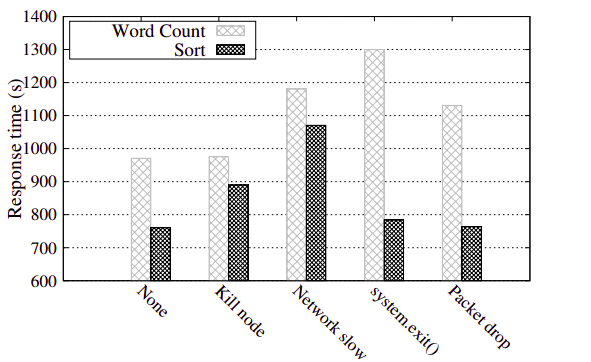
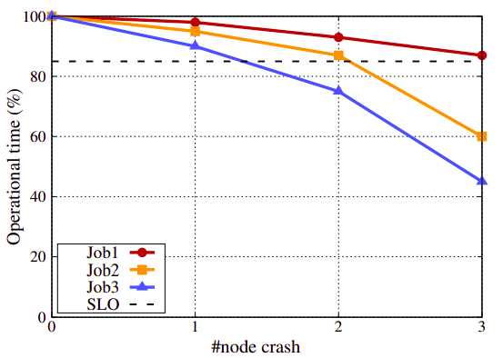
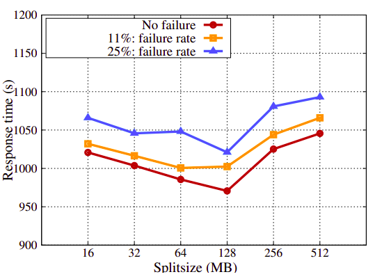

# Teste

Infelizmente o grupo não foi capaz de realizar os testes pelo não funcionamento súbito do cluster, por isso foi realizada uma extensa pesquisa com finalidade de demonstrar a capacidade do hadoop em relação a tolerância a falhas e performance.

## Teste de Performance e Tolerância a falhas

### Modelos de Falhas no Hadoop MapReduce  
Em sistemas distribuídos como o Hadoop, falhas são comuns. Um estudo do Google revelou que, em média, um job MapReduce envolvendo 268 nós enfrenta falhas em cinco deles. O Hadoop, baseado no Google File System, foi projetado para ser tolerante a falhas, mas sua arquitetura distribuída, muitas vezes composta por hardware de baixo custo, pode resultar em perda de dados, inconsistências e falhas de tarefas. As falhas no Hadoop MapReduce podem ser classificadas em três tipos principais:  

- **Falha de Tarefa**: Ocorre quando um mapper ou reducer é interrompido devido a corrupção de dados, contenção de recursos ou bugs. O TaskTracker notifica o JobTracker e a tarefa é reiniciada em outro nó.  
- **Falha de TaskTracker**: Se um TaskTracker para de responder, o JobTracker espera 10 minutos antes de removê-lo do pool de nós disponíveis.  
- **Falha de JobTracker**: É a falha mais crítica, pois o JobTracker é um ponto único de falha. Quando ele falha, todos os jobs em execução são perdidos.  

### Mecanismo de Tolerância a Falhas no Hadoop  
O Hadoop adota um mecanismo de tolerância a falhas baseado na reexecução de tarefas e monitoramento periódico. Quando uma tarefa falha, o nó worker notifica o master, que tenta redistribuir a tarefa para um nó saudável. Se um TaskTracker falha, o JobTracker detecta a ausência de seus heartbeats e redistribui suas tarefas. Caso o JobTracker falhe, ele é reiniciado automaticamente, mas os jobs em execução precisam ser reenviados, aumentando o tempo de execução e o custo computacional.

### Configuração do experimento realizado

Para a pesquisa analisada, um cluster Hadoop foi implantado utilizando 5 nós. Cada nó consistia em uma máquina virtual com 3 núcleos de CPU e 2 GB de memória, conforme mostrado na Tabela II. O Hadoop 2.7.4 foi executado com a configuração padrão no CentOS Linux. No cluster, um nó foi designado como mestre, responsável pelos processos JobTracker e NameNode, enquanto os demais atuaram como nós escravos, executando os processos DataNode e TaskTracker. Os TaskTrackers foram configurados com 8 slots para tarefas de mapeamento e 4 slots para tarefas de redução. O Hadoop Distributed File System (HDFS) utilizou um tamanho de bloco de 128 MB, e o fator de replicação foi definido como 2 para os dados de entrada e saída.

### Injeção de Falhas

No estudo é utilizado uma ferramenta MRBS para injeção de falhas, foi tratada de maneira distinta dependendo do tipo de falha testada. Para simular falhas, foram considerados os seguintes cenários:

- **Falha de nó:** Para implementar uma falha de nó, o nó foi desligado ou o comando `kill` do Linux foi utilizado para encerrar os processos TaskTracker e DataNode em execução.
- **Falha de processo de tarefa:** Para simular esse tipo de falha, foi encerrado o processo que executava uma tarefa específica em um nó.
- **Falha de software de tarefa:** Para essa falha, foi lançada uma exceção durante a execução de uma tarefa de mapeamento ou redução.

### Workload

As cargas de trabalho utilizadas pela ferramenta MRBS representam diferentes tipos de processamento, variando entre computacionalmente intensivas e intensivas em dados. A MRBS inclui cinco benchmarks de diferentes domínios: mineração de dados, inteligência de negócios, processamento de texto, bioinformática e sistemas de recomendação. Neste experimento, foi selecionada a carga de trabalho intensiva em dados do **Processamento de Texto**, uma aplicação MapReduce que analisa logs de motores de busca e sites.

### Impacto de Falhas

Estudos anteriores investigaram o impacto de diferentes tipos de falhas no desempenho de clusters Hadoop. Em um experimento conduzido em um cluster de 5 nós executando uma carga de trabalho de Processamento de Texto de 10 GB, foram analisados os tempos de resposta para os trabalhos **WordCount** e **Sort**, considerando a injeção de falhas controladas.

A imagem abaixo compara o tempo de resposta para cada tipo de falha para cada aplicação:

### Experimentos Relatados na Literatura

Estudos anteriores relataram experimentos sobre tolerância a falhas em clusters Hadoop. No primeiro experimento analisado, um cluster Hadoop de 5 nós foi executado com uma carga de trabalho de Processamento de Texto de 10 GB. Os resultados mostraram que o impacto no tempo de resposta dos trabalhos MapReduce depende do tipo de falha.

O estudo analisado apresenta o tempo de resposta dos trabalhos *WordCount* e *Sort* sob diferentes falhas injetadas. O eixo x representa os diferentes tipos de falha, enquanto o eixo y mostra o tempo total de resposta. Os trabalhos foram executados sem falhas para estabelecer uma linha de base, onde *WordCount* levou aproximadamente 970 segundos e *Sort* cerca de 760 segundos.

- **Falha de remoção de nó**: Quando um nó foi removido do cluster em tempo de execução, observou-se que o tempo de resposta do *WordCount* não foi afetado, demonstrando que aplicações intensivas em CPU podem ser recuperadas pelo Hadoop sem impacto significativo.

Na imagem a seguir podemos perceber o comportamento do sistema para diferente quantidade de nós falhos:

- **Falha de rede lenta**: Os pacotes de rede foram atrasados por alguns segundos, impactando o tempo de resposta das tarefas.
- **Falha de processo de tarefa**: Uma falha de tarefa foi simulada chamando a função `system.exit()` no código da aplicação, causando um impacto mais significativo.

Na imagem a seguir evidencia o tempo de resposta quando uma falha de processo ocorre de acordo com a variação no tamanho dos dados:

- **Falha por perda de pacotes**: Uma porcentagem de pacotes foi descartada em vários nós, afetando especialmente a aplicação *Sort*, que depende mais da comunicação em rede.

### Disponibilidade do Cluster Hadoop

Outro estudo relatado investigou a disponibilidade do cluster sob diferentes tamanhos de trabalho. Foram realizados experimentos executando a aplicação *WordCount* em um cluster de 5 nós com diferentes volumes de entrada:

- **Trabalho 1**: 1 GB
- **Trabalho 2**: 5 GB
- **Trabalho 3**: 10 GB

O estudo mostra que a Hadoop pode tolerar até três falhas de nós ao executar um trabalho pequeno (1 GB), enquanto, para um trabalho maior (10 GB), a disponibilidade do cluster se reduz para 85% após a falha de um nó. Isso indica que aplicações com menor volume de entrada podem ser recuperadas com um nível aceitável de disponibilidade.

### Impacto do Tamanho da Divisão de Entrada (*Split-Size*)

Em outro experimento, foi analisado o impacto do tamanho da divisão de entrada no tempo de resposta do *WordCount* sob taxas de falha de 11% e 25%. O estudo indica que o melhor tempo de resposta foi alcançado quando o tamanho da divisão foi de 128 MB, que corresponde ao tamanho padrão de um bloco HDFS.

Quando o tamanho da divisão foi maior que 128 MB, o tempo de resposta aumentou, pois tamanhos maiores exigem mais *mappers* para acessar os dados, aumentando o tempo de execução. O estudo mostrou que falhas de tarefas causam um impacto maior no tempo de execução quando o tamanho da divisão é grande, pois menos nós estão disponíveis para reexecutar as tarefas falhas.

### Pensamentos finais e conclusão

Os estudos revisados indicam que diferentes tipos de falhas impactam o desempenho das aplicações de forma variável. Aplicações intensivas em CPU, como **WordCount**, mostram maior resiliência a falhas de nó, enquanto aplicações que dependem fortemente da comunicação entre nós, como **Sort**, são mais sensíveis a problemas na rede.

Os estudos analisados indicam que falhas são comuns em sistemas distribuídos devido ao grande volume de dados processados. Empresas e desenvolvedores que utilizam Hadoop MapReduce precisam garantir que o sistema seja testado contra diferentes tipos de falhas.

Os experimentos revisados demonstram que o Hadoop é razoavelmente resistente a falhas, apresentando pequenos atrasos mesmo com taxas de falha elevadas. No entanto, o impacto das falhas depende de vários fatores, como:

- Tipo de trabalho executado
- Tipo de falha
- Taxa de falhas
- Tamanho dos blocos HDFS

A partir dessas análises, conclui-se que mecanismos aprimorados de tolerância a falhas são essenciais para garantir a confiabilidade e eficiência dos clusters Hadoop, especialmente para cargas de trabalho dependentes de comunicação intensiva.

## Referência
S. Yassir, Z. Mostapha and C. Tadonki, "Analyzing fault tolerance mechanism of Hadoop Mapreduce under different type of failures," 2018 4th International Conference on Cloud Computing Technologies and Applications (Cloudtech), Brussels, Belgium, 2018, pp. 1-7, doi: 10.1109/CloudTech.2018.8713332.